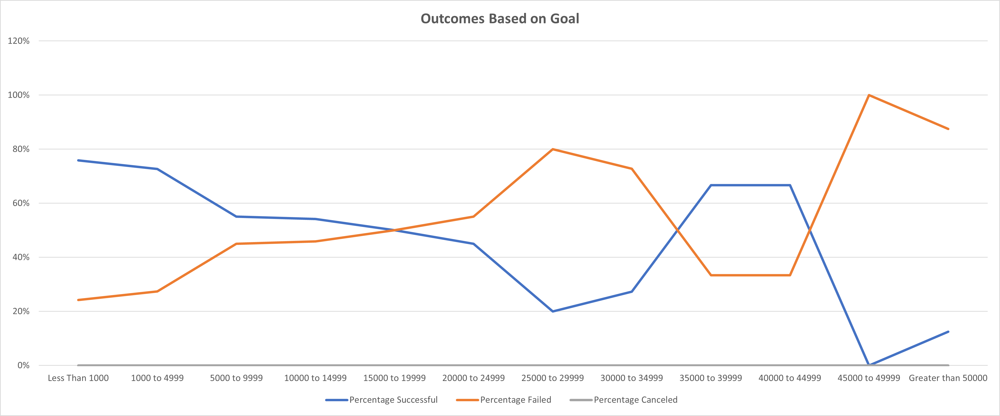

# Kickstarting with Excel

## Overview of Project

### Purpose

The aim of this project is to provide a comprehensive analysis of Kickstarter data within the theater project category to assess the impact of a) project launch date and b) fundraising goal on the outcome of a Kickstarter (i.e. successful, failed, or canceled). Results will help guide decision-making and expectations of the client regarding their likely success given the parameters of their own Kickstarter campaign.

## Analysis and Challenges

Two separate analyses were conducted to acheive project goals: 1) an analysis of outcomes based on launch date and 2) an analysis of outcomes based on goals. Data on several thousand Kickstarter campaigns were retrieved and tabulated into a spreadsheet. 

The following parameters were included in the initial spreadsheet:

- **id**: unique number for each record
- **name**: title of project
- **blurb**: project description
- **goal**: fundraising goal
- **pledged**: total amount pledged by backers
- **outcomes**: whether project succeeded, failed, or was canceled
- **country**: country of origin for Kickstarter creator
- **currency**: currency funds are collected in
- **deadline**: date fundraiser ended (Unix time)
- **launched_at**: date fundraiser began (Unix time)
- **staff_pick**: whether fundraiser was featured as a "Staff Pick" on the Kickstarter website
- **backers_count**: total number of backers for a project
- **spotlight**: whether the fundraiser was featured as a "Spotlight" project on the Kickstarter website
- **Category and Subcategory**: The parent category that the project is classified as (e.g. "film" or "technology") as well as the related subcategory

Since the client desired information about theater projects specifically, data was filtered to only include data within that parent category.

### Analysis of Outcomes Based on Launch Date

To analyze the relationship between the project launch date and the project outcome, a PivotTable was generated using the following fields:

- **Filters**: Parent Category, Year
- **Columns**: outcomes
- **Rows**: Date Created Conversion
- **Sum Values**: Count of outcomes

PivotTable data was filtered to only include data in the "theater" parent category. Data from all years was utilized and organized by month. 

Data indicated that, across all years, the total number of successful theater projects peaked in May before steadily decreasing into September (Fig. 1). The number of failed theater projects increased slightly from May to August, but overall numbers were consistently lower than the number of successful projects. Canceled projects were consistently low across all months and less than both the successful and failed theater projects.

### Analysis of Outcomes Based on Goals

To analyze the relationship between the project fundraising goal and the project outcome, different brackets of fundraising goals were established to sort data. Different outcomes were counted for each bracket. The total number of projects in each bracket were calculated by summing all outcomes within the bracket. These numbers were then used to calculate the percentage of each outcome within a given bracket.

Data was filtered to only include data in the "theater" parent category and "plays" subcategory.

For projects less than 1000, 76% of projects succeeded and 24% failed (Fig. 2). However, as the viewer moves along the different project goal brackets detailed on the x-axis, there are several points where this trend inverts and inverts again. There were zero canceled projects within the "plays" subcategory.

### Challenges and Difficulties Encountered

When the dataset was intially retrieved, several informative parameters were in an undesirable format or absent entirely. For example, project launch dates and deadlines were in units of Unix time, which are uninterpretable dates and times for the average individual. Category and Subcategory were consolidated into a single column, limiting the ability to analyze the two categories separately. Other descriptive metrics such as percentage funded and average donation were absent entirely. To amend these issues, Unix times in the "launched_at" and "deadline" columns were converted to dates and stored in the "Date Created Conversion" and "Date Ended Conversion" columns, respectively. The "Category and Subcategory" column was split into two separate columns of "Parent Category" and "Subcategory". New columns of "Percentage Funded" and "Average Donation" were calculated and added to the dataset.

## Results

- What are two conclusions you can draw about the Outcomes based on Launch Date?
    - First, across all projects in the "theater" parent category, more projects succeeded than failed across all months. Notably, the gap between successful and failed theater projects is almost non-existent for the month of December. A possible reason for this is due to the holidays. Many nations experience gift-giving holidays around this time and, as such, people are likely have less discretionary income to spend on Kickstarters that won't provide products for months.

    - Second, the number of successful projects is highest May through August. The gap between successful and failed projects is also greatest between these months. While it's more challenging to confidently identify reasons for this trend (e.g. students are working summer jobs and have more descretionary funds or maybe the summer weather makes people more willing to spend money), data indicates that May is the best month to launch a Kickstarter.

- What can you conclude about the Outcomes based on Goals?
    - Comparing the fundraising goal to project outcomes suggest that project goals that are less than 1000 of a given currency are more likely to succeed than projects with higher goals. However, there's an exception to this for project goals between 35000 and 44999. The reason for this inversion in expectations likely has to do with the total number of projects that fall into these higher goal brackets. For example, the 35000 to 39999 goal bracket only has 6 total projects compared to the less than 1000 bracket, which has 186 total projects. Therefore, a single failed or successful project is more likely to disproportionately impact the overall outcome percentages within those higher goal brackets. Given those limitations, percentages for higher goal brackets should be looked at with a critical eye.

- What are some limitations of this dataset?
  - Outside of the previously mentioned data limitations that were amended using data transformations, there are other limitations of this dataset. For example, the analysis of outcomes based on goals uses all data in the "theater" parent category and "plays" subcategory. Goals were bracketed based on their numerical values. However, those values are in 1 of 12 different currencies, but data was summarized as if the assumed ratio of the value of each currency was 1:1. This is a fallacious assumption (e.g. 1 USD = 0.76 GBP), so it's possible that several data points are miscategorized. The client may wish to have the goal and pledge amounts converted to a single currency to allow for more direct comparison.

- What are some other possible tables and/or graphs that we could create?
  - One additional table to create would be a currency conversion table so that all project goals and pledges could be directly compared. Such a table would help address some of the aforementioned dataset limitations.
  - Another table/graph that could be helpful would be one that layers the "Average Donation" and "Pledged" data over the graph of Outcomes Based on Goal (Fig. 2). This could help parse apart the trend we saw of the various inversion points of the percentage successful versus the percentage failed. A graph like that might help us see if the reason that some of the projects with the higher fundraising goals (35000-44999) were more often successful because there were more people backing that project or if fewer or the same amount of backers donated higher amounts.
  - Finally, it might be interesting to combine data from the two analyses into one table. For example, comparing the total number of successful projects for each month to the total number of each different goal bracket. We may find that the reason so many more projects are successful in May is that more of those projects have lower fundraising goals, which tend to be more successful.
